##  Table of Contents
- [About the Project](#-group-15--atm-banking-system)
- [Poster](#-poster)
- [Project Introduction](#-project-introduction)
- [Tech Stack](#️-tech-stack)
- [Key Features](#-key-features)
- [System Architecture](#️-system-architecture)
- [Screenshots](#-screenshots-of-the-app)
- [Frontend Navigation Flow](#-frontend-navigation-flow)
- [Project Structure](#-project-structure)
- [Installation & Setup](#-installation--setup)
- [API Documentation](#-api-documentation)
- [CI/CD & Automated Workflows](#️-cicd--automated-workflows)
- [Team](#-team)
- [Tools](#-tools)
- [Presentation](#-presentation-of-the-app)
- [License](#license)

YouTube video esitys suomeksi https://youtu.be/FvJnko7foXg

# Group 15 Project-ATM Banking System
This is a course project designed to simulate real-world bank ATM operations. The goal was to design and implement a fully functional ATM simulation that reflects real-world banking workflows — from secure card authentication to multi-account transaction management.

# Poster
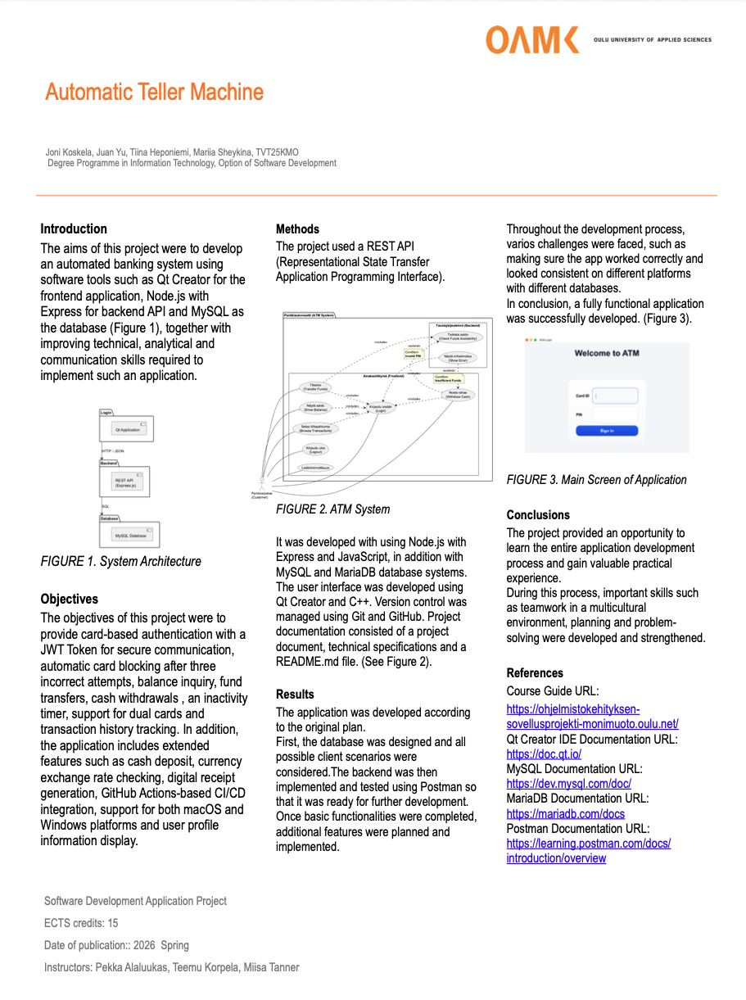

<a href="#-table-of-contents">⬆️ Back to top</a>

## Project Introduction
The system follows a client-server model with three independent layers: 
* Frontend (**Qt/C++**): Provides a desktop Graphical User Interface (GUI) that replicates a physical ATM interface, built with Qt Designer and communication with the backend via REST API for interactive user operations. 
* Backend (**Node.js/Express**): Processes core business logic, such as PIN verification, transaction processing and JWT-based session security. 
* Database (**MySQL/MariaDB**): Stores user, card and account information as well as a full transaction history in a five-table relational schema.

<a href="#-table-of-contents">⬆️ Back to top</a>

## Tech Stack

### Frontend
|Component|Technology|
|-----------|-----------|
|Framework|Qt 5.15+ (C++)|
|UI Design|Qt Designer|
|Build System|CMake|
|Networking|QNetworkAccessManager (for asynchronous REST API calls)|
|Data Parsing|QJsonDocument & QJsonObject|

### Backend
|Component|Technology|
|-----------|-----------|
|Runtime|Node.js|
|Framework|Express.js|
|Security|bcryptjs (PIN hashing), jsonwebtoken (JWT auth)|
|Database Client|mysql2|
|Middleware|morgan, dotenv, cookie-parser|

### Database
|Component|Technology|
|-----------|-----------|
|System|MySQL 8.0+ / MariaDB|
|Schema|Relational multi-table design with Transactional Integrity|
|Stored Procedures|deposit, withdrawal, transfer|

The full entity-relationship diagram:

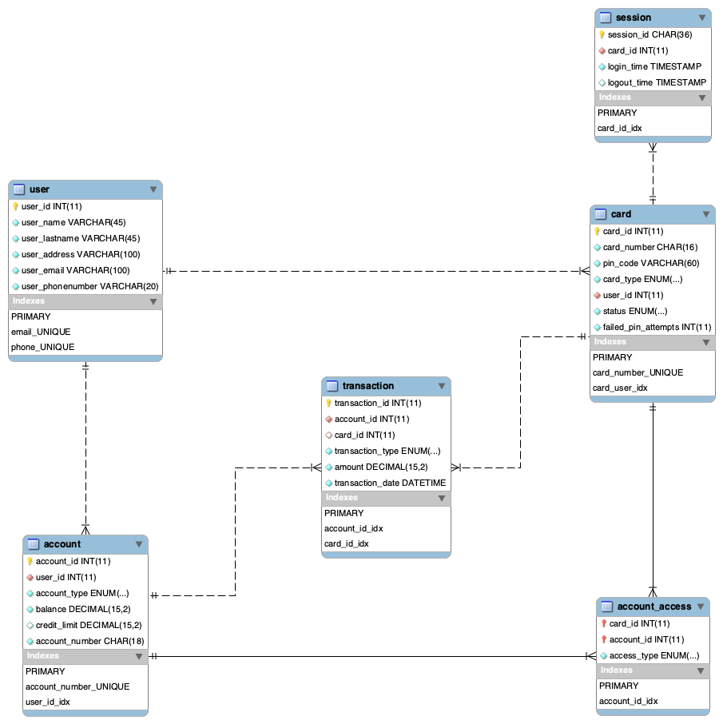

<a href="#-table-of-contents">⬆️ Back to top</a>

## Key Features  
**Multi-Account Support**: A single card can be linked to multiple accounts. After login, users choose between a Debit or Credit account before proceeding to the main menu. 

**Core Financial Transactions**:
* Withdrawal: Checks balance or credit limits before proceeding. Supports fixed amounts (20, 40, 50, 100) or a custom amount - dispensed in denominations of 20 and 50.
* Deposit: Accepts both banknotes and coins. Increases account balance and logs the transaction
* Transfer: Sends funds to another account by account number. Validates that the recipient account exists and that the sender has sufficient funds

**Security Mechanisms**:
* PIN hashing: Stored using bcryptjs - no plain-text passwords in the database.
* JWT authentication: Every API request requires a valid token to prevent unauthorized access.
* Card blocking: After 3 failed PIN attempts the card is automatically locked. Failed attempts are recorded in the database.

**Additional Features**:
* Currency Conversion: Calculates amounts between EUR, USD and GBP. 
* Digital Receipt: Always shows date, time and current balance. Displays balance inquiry results or full transaction details depending on the operation performed

<a href="#-table-of-contents">⬆️ Back to top</a>

## System Architecture
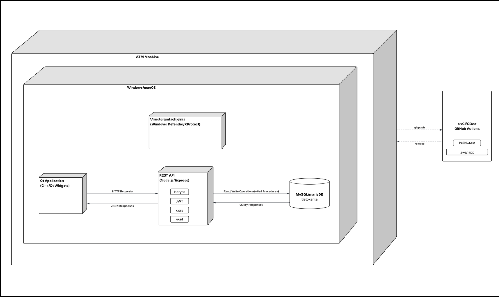

**Communication Flow**
1. Qt client sends an HTTP request with a JWT token attached
2. Express middleware verifies the token and checks authorization
3. Business logic is processed and a stored procedure is called
4. Database executes the transaction and returns the result
5. REST API sends a JSON response back to the Qt client

<a href="#-table-of-contents">⬆️ Back to top</a>

## Screenshots of the app
* macOS installation:
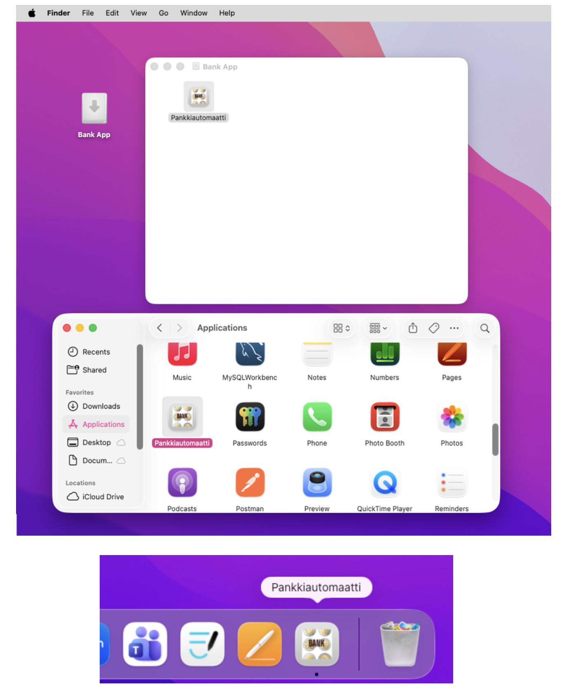
* macOS Login page:
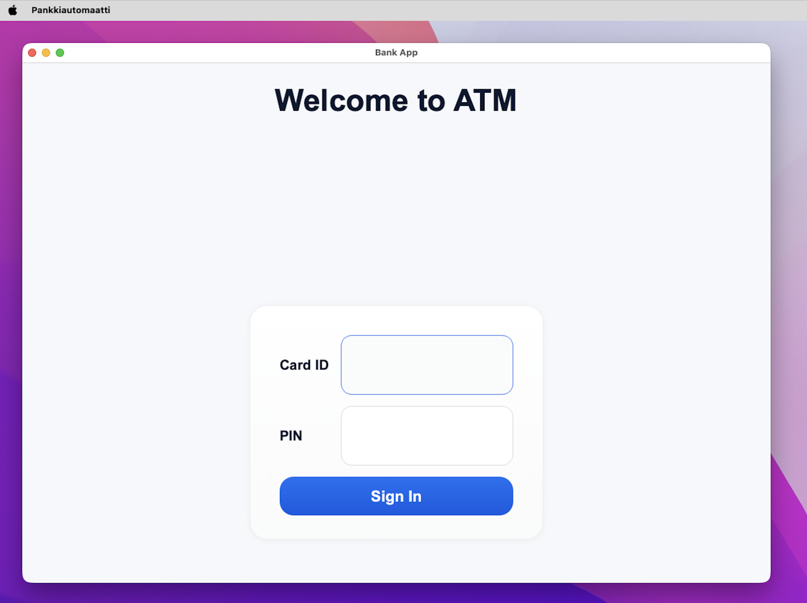
* Windows installation: 
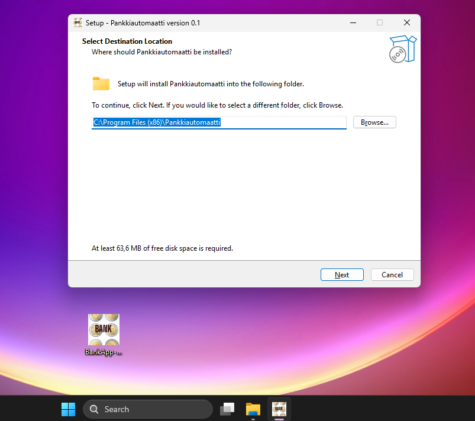
* Windows Login page:
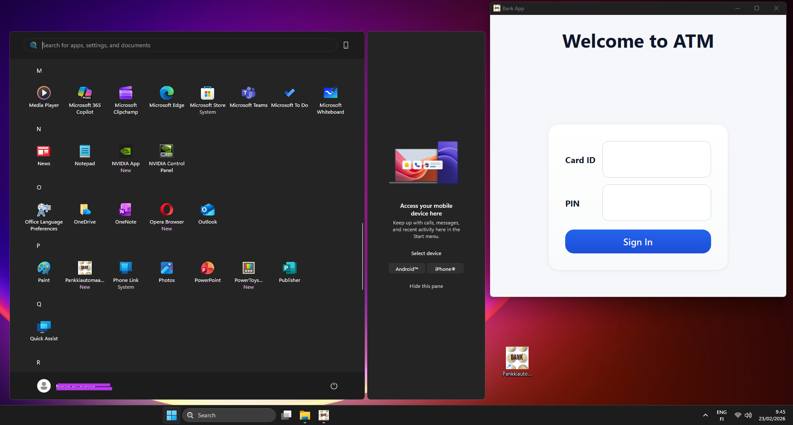
* Dual card choice page:
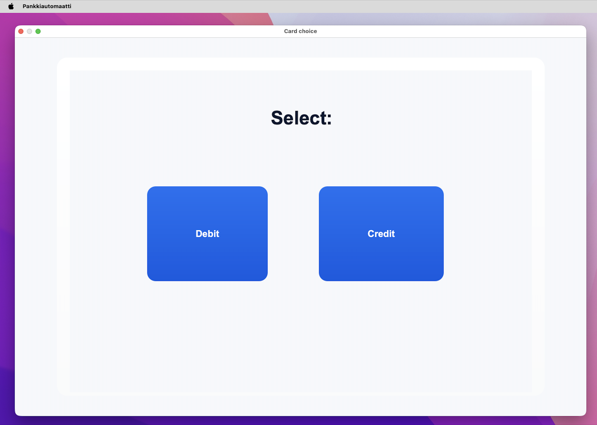
* Menu Screen:
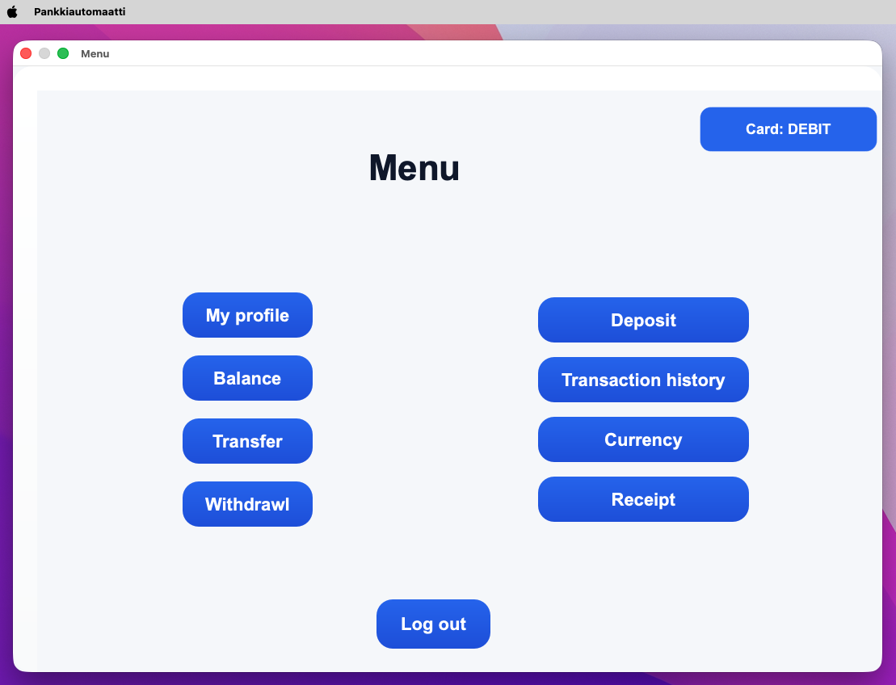
* One of transactions example (Withdrawal: succesful transaction and error transaction):
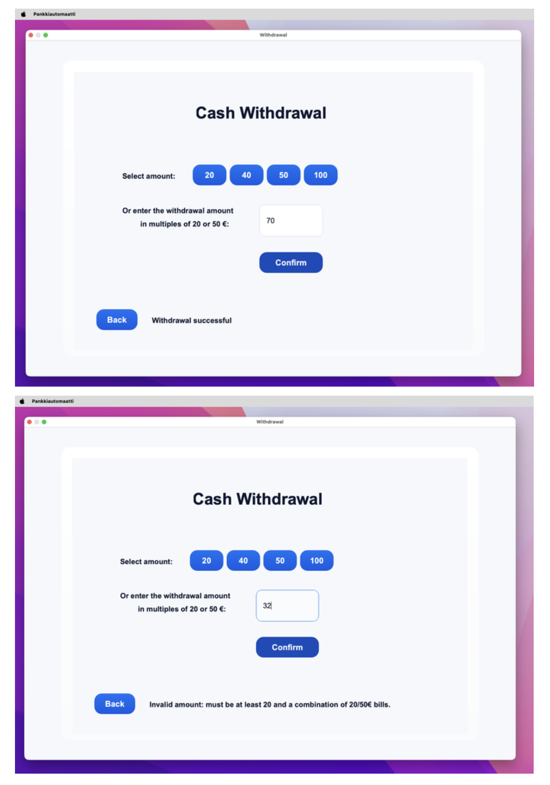
* Transaction History:
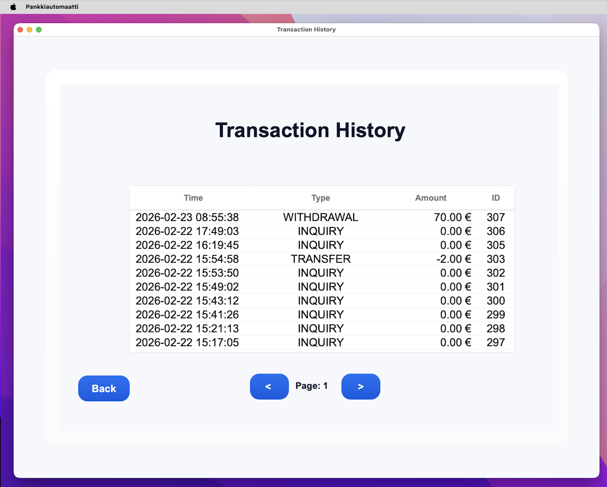
* receipt examples (user used all features, user used nothing):
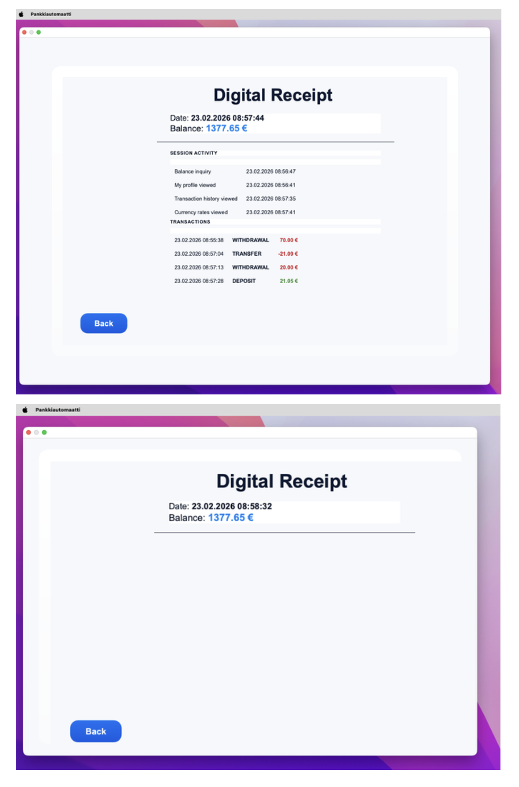

<a href="#-table-of-contents">⬆️ Back to top</a>

## Frontend Navigation Flow

```text
                        ┌─────────────┐
                        │    START    │
                        └──────┬──────┘
                               │
                               ▼
                    ┌──────────────────────┐
     ┌────────────▶ │  Login (Card + PIN)  │◀────┐
     │              └──────────┬───────────┘     │
     │                         │                 │
     │                  ┌──────▼──────┐          │
     │                  │   PIN OK?   │          │
     │                  └──┬───────┬──┘          │
     │                  YES│    NO │             │
     │                     │       └─────────────┘
     │                     │        (failed attempt)
     │                     │
     │             ┌───────▼────────┐
     │             │ 3 failed PIN   │
     │             │ attempts?      │
     │             └───┬───────┬────┘
     │               NO│    YES│
     │                 │       ▼
     │                 │  ┌──────────────┐
     │                 │  │ Card Blocked │
     │                 │  └──────────────┘
     │                 │
     │                 ▼
     │           ┌─────────────────────┐
     │           │ Single account?     │
     │           └────┬───────────┬────┘
     │             YES│        NO │
     │                │           ▼
     │                │  ┌──────────────────┐
     │                │  │ Debit vs Credit  │
     │                │  │ Selection        │
     │                │  └────────┬─────────┘
     │                │           │
     │                └─────┬─────┘
     │                      ▼
     │   ┌─────────────────────────────────────────────────────────────────────────────────────────────────────┐
     └── │                             Main Menu                                                               │◀┐
(logout) └──┬─────────┬─────────┬──────────┬─────────────────┬──────────────────┬────────────┬───────────┬─────┘ │
            │         │         │          │                 │                  │            │           │       │
            ▼         ▼         ▼          ▼                 ▼                  ▼            ▼           ▼       │
        ┌──────────┐┌───────┐┌─────────┐┌──────────┐     ┌────────┐           ┌─────────────┐┌────────┐┌────────┐│
        │My Profile││Balance││ Deposit ││Withdrawal│     │Transfer│           │ Transaction ││Currency││Receipt ││
        │          ││       ││         ││          │     │        │           │ History     ││        ││        ││
        └────┬─────┘└─┬─────┘└─┬───────┘└─┬────────┘     └───┬────┘           └───┬─────────┘└───┬────┘└───┬────┘│
             │        │        │          │                  │                    │              │         │     │
             │        │        ▼          ▼                  ▼                    ▼              │         │     │
             │        │  ┌────────────┐┌──────────────────┐┌──────────────────┐ ┌──────────┐     │         │     │
             │        │  │Enter Amount││20 / 40 / 50 / 100││ Receiver account │ │Pages ◀/▶ │     │         │     │
             │        │  └─────┬──────┘│or custom amount  ││ number and amount│ └─────┬────┘     │         │     │
             │        │        │       └────────┬─────────┘└────────┬─────────┘       │          │         │     │
             │        │        │                │                   │                 │          │         │     │
             │        │        ▼                ▼                   ▼                 │          │         │     │
             │        │  ┌────────────┐  ┌────────────┐     ┌────────────┐            │          │         │     │
             │        │  │Confirmation│  │Confirmation│     │Confirmation│            │          │         │     │ 
             │        │  └─────┬──────┘  └─────┬──────┘     └─────┬──────┘            │          │         │     │
             │        │        │               │                  │                   │          │         │     │
             │        │        │               │                  │                   │          │         │     │
             │        │        │               │                  │                   │          │         │     │
             │        │        │               │                  │                   │          │         │     │
             │        │        │               │                  │                   │          │         │     │
             └────────┴────────┴───────────────┴──────────────────┴───────────────────┴──────────┴─────────┴─────┘
                                                       Back to Main Menu
```

<a href="#-table-of-contents">⬆️ Back to top</a>

## Project Structure
```text
backend/
├── app.js
├── bin/www
├── middleware/
│   └── auth.js
├── models/
│   ├── login_model.js
│   ├── user_model.js
│   ├── transaction_model.js
│   ├── account_model.js
│   ├── account_access_model.js
│   └── card_model.js
├── routes/
│   ├── login.js
│   ├── account.js
│   ├── account_access.js
│   ├── card.js
│   ├── currency.js
│   ├── database.js
│   ├── index.js
│   ├── transaction.js
│   └── user.js
├── package.json
└── package-lock.json
```
```text
frontend/
├── CMakeLists.txt
├── bank-automat.iss
├── main.cpp
├── headers/
│   ├── environment.h
│   ├── mainwindow.h
│   ├── menu.h
│   ├── debitvscredit.h
│   ├── clientinfo.h
│   ├── balance.h
│   ├── deposit.h
│   ├── withdrawal.h
│   ├── transaction.h
│   ├── transfer.h
│   ├── currency.h
│   └── receipt.h
├── sources/
│   ├── environment.cpp
│   ├── mainwindow.cpp
│   ├── menu.cpp
│   ├── debitvscredit.cpp
│   ├── clientinfo.cpp
│   ├── balance.cpp
│   ├── deposit.cpp
│   ├── withdrawal.cpp
│   ├── transaction.cpp
│   ├── transfer.cpp
│   ├── currency.cpp
│   └── receipt.cpp
└── forms/
    ├── mainwindow.ui
    ├── menu.ui
    ├── debitvscredit.ui
    ├── clientinfo.ui
    ├── balance.ui
    ├── deposit.ui
    ├── withdrawal.ui
    ├── transaction.ui
    ├── transfer.ui
    ├── currency.ui
    └── receipt.ui
```

<a href="#-table-of-contents">⬆️ Back to top</a>
## Installation & Setup 
### Option 1️⃣
> Quick Install (End Users)

#### Windows

1. Download bank-automat-setup.exe from the latest release
2. Run the installer and follow the on-screen steps
3. Launch Bank Automat from the Start Menu or Desktop shortcut

#### macOS (Apple Silicon)

1. Download bank-automat.dmg from the latest release
2. Open the .dmg and drag the app to your Applications folder

⚠️ The app requires a running backend server to function. Contact your system administrator for the server address, or set up your own using Option 2 below.

### Option 2️⃣

#### First step: Clone the Repository
```bash
git clone https://github.com/25kmo-project/group_15.git
```
* Open the folder **group_15**
```bash
cd group_15
```
#### Second step: Database Setup

##### Prerequisites: Database Server

Before running the database scripts, make sure MySQL is running on your machine.

**macOS — using XAMPP:**
1. Download and install [XAMPP for macOS](https://www.apachefriends.org/download.html)
2. Open the XAMPP Control Panel
3. Click **Start** next to **MySQL Database**

**Windows — using UniServer:**
1. Download and install [UniServer](https://sourceforge.net/projects/miniserver/)
2. Open the UniServer Control Panel
3. Click **Start** next to **MySQL**
______

> The **database/** folder contains all scripts needed to initialize the system. Run them in order

* Open **database/db_setup.sql** and replace **YOUR_PASSWORD_HERE** with a password of your choice

* Then run it using your root credentials, the database and user will be created:

For MySQL:

```bash
mysql -u root -p < database/db_setup.sql
```
 For MariaDB:
```bash
mariadb -u root -p < database/db_setup.sql
```
* Once the script finishes, the bank database is ready and the bank_admin user will have full access to it.

* Run the script that matches you database system, the tables and procedures will be created:

For MySQL:
```bash
mysql -u bank_admin -p < database/sql_script_mysql_version.sql
```
For mariaDB:
```bash
mariadb -u bank_admin -p < database/sql_script_mariadb_version.sql
```
*  (Optional) To populate the database with test accounts and client scenarios for development and testing, run the script that matches you database system:
For MySQL:
```bash
mysql -u bank_admin -p < database/db_client_scenarios.sql
```
For mariaDB:
```bash
mariadb -u bank_admin -p < database/db_client_scenarios.sql
```
#### Third step: Backend Environment
* Install all necessary dependencies. This will automatically install everything listed in package.json
```bash
cd backend
npm install
```
* Copy **.env.example** to a new file named **.env** 

Windows:
```bash
copy .env.example .env
```
 macOS / Linux
```bash
cp .env.example .env
```
* Generate a JWT Token, open **backend** folder in terminal
```bash
node create_secret.js
```
* Copy the output — you will need it in the next step.

* Then open **.env** in any text editor and fill in your values. (DB_PASSWORD=your_password_here, MY_TOKEN=your_jwt_secret_here)

* Launch the server.
```bash
npm start
```
* The API will be available at http://localhost:3000 by default.

#### Fourth step: Frontend Environment
* Ensure Qt 5.15+ and CMake are installed:

Qt Creator:
https://www.qt.io/development/offline-installers

Cmake : https://cmake.org/download/

* Open CMakeLists.txt directly with Qt Creator

<a href="#-table-of-contents">⬆️ Back to top</a>

## API Documentation

Base URL: http://localhost:3000

>  All endpoints except **/login** require a valid `Authorization: Bearer <token>` header.

---

### Authentication

|Method|Endpoint|Description|
|--------|----------|-------------|
|POST|/login|Authenticate with card ID and PIN. Returns JWT token, account IDs,account types. Blocks card after 3 failed attempts|

---

### Transactions 

|Method|Endpoint|Description|
|--------|----------|-------------|
|POST|/transaction/withdraw|Withdraw funds via stored procedure. Checks balance and card status|
|POST|/transaction/deposit|Deposit funds via stored procedure. Accepts any positive amount|
|POST|/transaction/transfer|Transfer funds to another account by account number|
|GET|/transaction/balance?account_id=&card_id=|Get current balance. Logs an INQUIRY transaction|
|GET|/transaction/history?account_id=&card_id=&page=|Get paginated transaction history (10 per page)|
|GET|/transaction/id/:id|Get a single transaction by ID|

---

### Currency 

|Method|Endpoint|Description|
|--------|----------|-------------|
|GET|/currency/latest|Get latest EUR → USD, GBP exchange rates|
|GET|/currency/change|Get rate change and percentage difference from previous business day|

---

### Accounts 

|Method|Endpoint|Description|
|--------|----------|-------------|
|GET|/accounts|Get all accounts|
|GET|/accounts/:id|Get account by ID|
|POST|/accounts|Create new account|
|PUT|/accounts/:id|Update account|
|DELETE|/accounts/:id|Delete account|

---

### Cards

|Method|Endpoint|Description|
|--------|----------|-------------|
|GET|/cards|Get all cards|
|GET|/cards/:card_id|Get card by ID|
|POST|/cards|Create new card (PIN is hashed automatically)|
|PUT|/cards/:card_id|Update card info (excluding PIN)|
|PUT|/cards/:card_id/pin|Update PIN (hashed with bcrypt)|
|DELETE|/cards/:card_id|Delete card|

---

### Users

|Method|Endpoint|Description|
|--------|----------|-------------|
|GET|/user|Get all users|
|GET|/user/:user_id|Get user by ID|
|POST|/user/:user_id|Create new user|
|PUT|/user/:user_id|Update user address, email, phone|
|DELETE|/user/:user_id|Delete user|

---

### Account Access

|Method|Endpoint|Description|
|--------|----------|-------------|
|GET|/account_access|Get all access records|
|GET|/account_access/card/:card_id|Get all accounts accessible by a card|
|GET|/account_access/account/:account_id|Get all cards with access to an account|
|GET|/account_access/:card_id/:account_id|Get access type for specific card + account|
|POST|/account_access|Grant access (FULL or VIEW_ONLY)|
|PUT|/account_access/:card_id/:account_id|Update access type|
|DELETE|/account_access/:card_id/:account_id|Revoke access|

<a href="#-table-of-contents">⬆️ Back to top</a>

## CI/CD & Automated Workflows

The project uses **GitHub Actions** for continuous integration and automated releases.

**Build Workflows**  
Every pull request to the **main** branch triggers automated builds for Windows (MSVC 2022) and macOS (Apple Silicon/ARM64) to ensure code stability and cross-platform compatibility.

**Release Workflows**  
Pushing a version **tag** (e.g., v1.0) automatically initiates the distribution process:

|Platform|Output|Tool|
|----------|--------|------|
|Windows|Installer `.exe`|Inno Setup|
|macOS (Apple Silicon)|Disk Image `.dmg`|macOS native|

<a href="#-table-of-contents">⬆️ Back to top</a>

## Team

All team members participated across all areas of the project.
Primary responsibilities were distributed as follows:

|Author|Primary Responsibilities|
|--------|-------------|
|[@juanyu0417](https://github.com/JuanYu0417)|Transaction feature(full stack)|
|[@jummijammi](https://github.com/jummijammi)|Deposit(full stack), Receipt(full stack)|
|[@tinnihkis](https://github.com/tinnihkis)|Withdrawal(full stack)|
|[@ecedevere](https://github.com/ecedevere)|User(full stack), Receipt(frontend)|

All other parts of the project were made together.

<a href="#-table-of-contents">⬆️ Back to top</a>

## Tools

* GitHub kanban board for task management
* MySQL Workbench for database planning and editing
* Postman for testing API
* Discord for communication with eachother in team
* Teams to communicate with teachers and to shared files with them
* VS Code and Qt Creator as IDE
* Git/GitHub for version control
* Inno Setup for installer
* Markddown PDF (extension for VS Code)
* Keynote for making presentation
* Microsoft PowerPoint for making presentation
* Canva for image collage


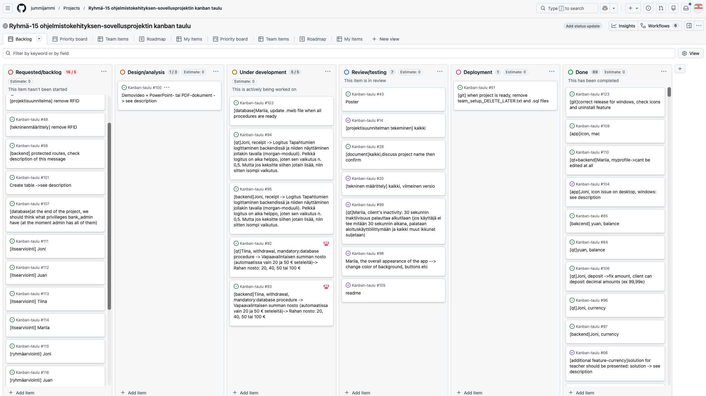
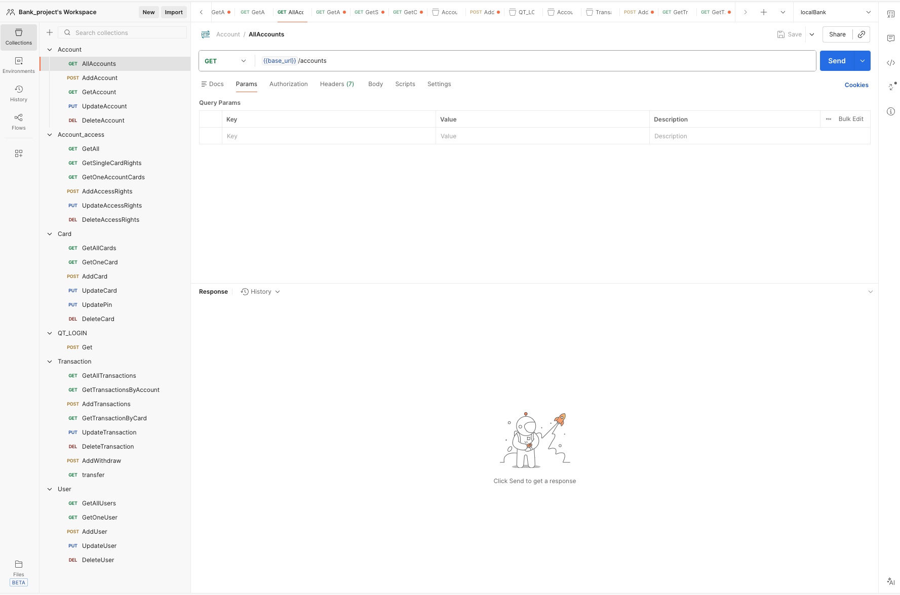

<a href="#-table-of-contents">⬆️ Back to top</a>

## Presentation of the app

[Bank App Presentation](https://github.com/25kmo-project/group_15/blob/main/Bank_App_Presentation_Group_15.pptx)

<a href="#-table-of-contents">⬆️ Back to top</a>

## License
This project is licensed under the [MIT License](LICENSE).

<a href="#-table-of-contents">⬆️ Back to top</a>