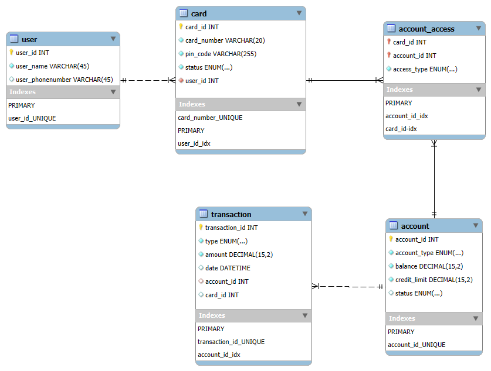

# Group 15 Project
## Backend-database
### User case
login by card number + pin code.The database only stores pin codes that have been hashed using bcryptjs.
After a user logs in, the system will provide selectable accounts for the user to operate:debit or credit.

......

### Data Structure
Database "bank" utilizes a 5-table relational schema:
#### Table: user
* user_id (PK, INT)
* user_name (VARCHAR(45))
* user.user_phonenumber (VARCHAR(45))
#### Table: card
Stores authentication credentials and their link to a user.
* card_id (PK, INT)
* card_number (VARCHAR(20), UNIQUE): The number used for ATM login.
* pin_code (VARCHAR(255)): Bcrypt-hashed password.
* status ENUM('Active', 'Blocked', 'Expired'). 
* user_id (FK, INT): Links the card to its owner in the user table.
#### Table: account
Stores financial data and overdraft rules.
* account_id (PK, INT)
* account_type ENUM('DEDIT', 'CREDIT', 'SAVINGS')
* balance (DECIMAL(15,2)): for debit card
* credit_limit (DECIMAL(15,2)): for credit card
#### Table: account_access (Junction Table,"many to many")
Connecting cards to multiple accounts.
* card_id (PK/FK, INT)
* account_id (PK/FK, INT)
* access_type (ENUM): ENUM('FULL', 'VIEW ONLY'):for futher fuctions,eg:parents-child account.
#### Table: transaction
A permanent, immutable audit trail of all account activities.
* transaction_id (PK, INT)
* type ENUM('Withdrawal', 'Deposit', 'Transfer', 'Inquiry')
* amount (DECIMAL(15,2))
* date (DATETIME)
* account_id (FK, INT): Links the transaction to the specific affected account.
